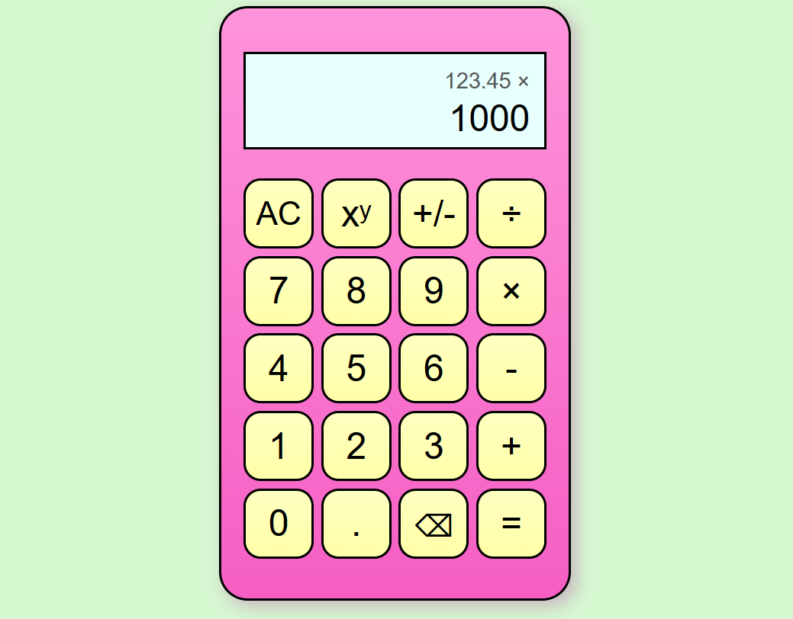

# Calculator
A deceptively simple calculator that has a lot going under the hood! This was a surprisingly challenging project that turned out to be far from boring. A detailed reflection can be found in the last section of this page.

**View project:** https://ellin.github.io/calculator/

## Project screenshots

## Features
- Decimal input
- Negative sign toggle
- Exponential formatting for large numbers
- Keyboard support
- Responsive sizing across mobile and desktop
- Error handling (e.g. division by zero)

## Skills practiced 
Through this project, I developed and practiced the following skills and knowledge:
- JavaScript objects & 'this' keyword
- JavaScript numbers & handling floating point errors (e.g. 0.1 + 0.3 = 0.30000000000000004)
- DOM manipulation
- String manipulation
- Manual testing, handling edge cases, troubleshooting bugs
- Responsive design with CSS flexbox & clamp
- Writing maintainable code (e.g. clear naming, consistent types, use of helper functions)

## Project status
Basically complete. May continue to add extra features.

## Project reflections
I began this project thinking I was going to make a beginner calculator app as coding practice that would take maybe 2 days to complete. Instead, this project ended up taking over 70 hours and 400 lines of code in JavaScript.

It turns out creating a calculator with a fixed 13 character display is not so trivial and trying to understand floating point errors can lead one down a deep rabbit hole ending with staring blankly at a [44-page paper about floating point arithmetic](https://www.itu.dk/~sestoft/bachelor/IEEE754_article.pdf). 

Although having a display limited to only 13 characters is not necessary for modern calculator apps, it was a design choice I made to emulate the style of traditional hand-held calculators. Since every character, including brackets, negative signs, and decimals ate into this limit, this affected how results needed to be formatted and/or rounded for the display. For results converted to exponential form, the display string needed to be carefully constructed to account for each part of the number including the sign, integer, decimal, exponent character, and exponent digits — all while minimizing the loss of significant digits and avoiding excessive trailing zeros. 

The display implementation would have been much easier if I had decided to set a separate limit for the number digits and an overall character limit for the display. Or, for example, always reserving a character for the sign.

The second big challenge was trying to decide the best way to handle floating point errors and what level of precision is "good enough" for a casual calculator. After all, my intention wasn't to build a scientific calculator fit for rocket scientists (though, the temptation was certainly there). In the end, I decided to round numbers to a level of precision enough to prevent floating point weirdness from becoming visible, remove trailing zero's for readability, and use a scaled version of epsilon as the margin of error during subtraction so that users see 0 as expected when subtracting numbers with floating point errors, e.g. (0.1 + 0.2) - 0.3.

Although I was able to prevent some common ways that floating point errors show up, I eventually discovered I would have to take an entirely different approach — most realistically, using the help of external libraries if I want a calculator with higher levels of precision. Nonetheless, unless one seeks to produce floating point errors, my calculator basically works as expected.

